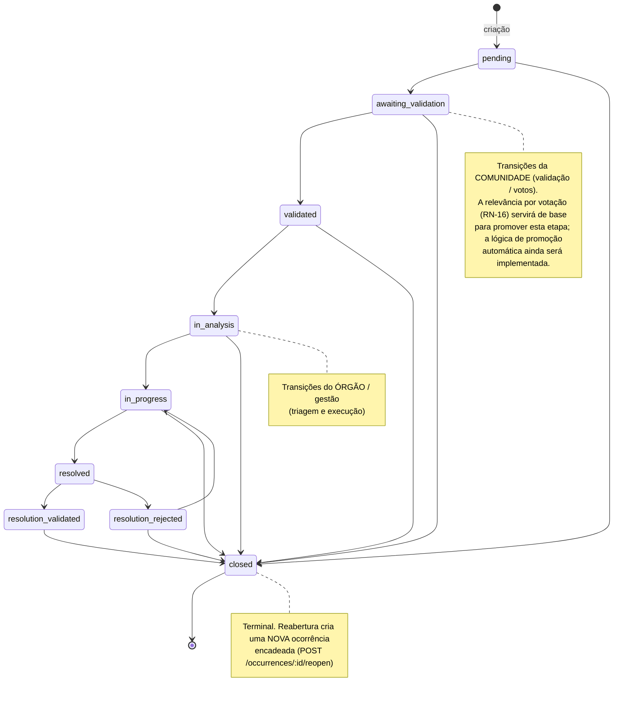

# 1. Regras de Negócio

> Cada regra diz **o que** impõe, **por que** existe e **onde** está implementada (arquivo/função).
> As regras de negócio são **definidas e validadas no backend** (`src/services/`,
> `src/controllers/`, `src/middlewares/` e as funções PostGIS dos `src/models/`); o **frontend** as
> consome e as reflete na interface. Para cada regra, o bloco **No front** descreve como a UI a
> aplica e aponta **divergências conhecidas** entre a mensagem da interface e a regra efetiva do
> servidor. Regras ainda planejadas são marcadas com *(Roadmap)* e detalhadas em
> [Plano de Projeto](./03-plano-de-projeto.md).

> **Escopo municipal (Videira/SC).** Todo o sistema opera dentro do município de **Videira/SC** —
> escopo fixo do projeto, **não** um dado de banco. No front, o mapa centraliza em
> `[-27.0078, -51.1519]` (zoom 14) e os textos reforçam o escopo (`currentMunicipality` em
> `src/data/mockData.ts`). No backend, o escopo se manifesta nos bairros cadastrados e no geofencing
> (RN-03).

## Índice de regras

| ID | Regra | Onde (backend) |
|----|-------|----------------|
| RN-01 | Login e identidade por CPF válido | `utils/cpf.js`, `services/authService.js` |
| RN-02 | Unicidade de e-mail e CPF no cadastro | `services/authService.js` |
| RN-03 | Geofencing — derivação do bairro pelo ponto | `services/occurrencesService.js`, `models/neighborhoodsModel.js` |
| RN-04 | Prevenção de duplicidade por raio geográfico | `services/occurrencesService.js`, `models/occurrencesModel.js` |
| RN-05 | Máquina de estados da ocorrência | `services/occurrencesService.js` |
| RN-06 | Trilha de auditoria de status (histórico) | `services/occurrencesService.js`, `models/occurrenceStatusHistoryModel.js` |
| RN-07 | Carimbo automático de `resolved_at` / `closed_at` | `models/occurrencesModel.js` |
| RN-08 | Reabertura / recorrência encadeada | `services/occurrencesService.js`, `models/occurrenceReopensModel.js` |
| RN-09 | Janela de edição da ocorrência | `utils/occurrenceEditWindow.js`, `services/occurrencesService.js` |
| RN-10 | Autorização de edição e exclusão (autor ou admin) | `services/occurrencesService.js` |
| RN-11 | Votação (avaliações) e recálculo de score | `services/evaluationsService.js` |
| RN-12 | Bloqueio de voto em ocorrência fechada | `services/evaluationsService.js` |
| RN-13 | Integridade de mídias (allowlist, limites, CASCADE) | `config/storage.js`, `middlewares/upload.js`, `services/occurrenceMediaService.js` |
| RN-14 | Privacidade dos dados do cidadão (sanitização) | `services/authService.js`, `utils/cpf.js` |
| RN-15 | Coerência categoria ↔ subcategoria | `services/occurrencesService.js` |
| RN-16 | *(Roadmap)* Relevância e priorização por votação | `services/evaluationsService.js` |
| RN-17 | Órgão responsável pela ocorrência | `controllers/occurrencesController.js` (back) · `mockData.ts`, `useTaxonomy.ts` (front) |

---

## RN-01 — Login e identidade por CPF válido

**O que:** o cadastro e o login usam o **CPF** como identificador de login. O CPF é normalizado
(apenas dígitos) e validado por formato (11 dígitos) e pelos **dois dígitos verificadores**;
sequências repetidas (`000…`, `111…`) são rejeitadas.

**Por que:** o CPF é a chave natural do cidadão perante a administração municipal; validar os
dígitos verificadores reduz cadastros inválidos/fraudulentos antes mesmo de consultar o banco.

**Onde:** `utils/cpf.js` (`normalizeCpf`, `isValidCpf`, `checkDigit`), consumido no fluxo de
`services/authService.js` (`login` busca o usuário por CPF normalizado).

**Comportamento:** CPF pode ser enviado com ou sem máscara. Credenciais inválidas ou usuário
inativo retornam **401 `INVALID_CREDENTIALS`** (mensagem genérica, sem revelar qual campo falhou).

**No front:** o CPF é validado no cliente (formato + dígitos verificadores) **antes** do envio e
normalizado para 11 dígitos no login/cadastro — `validateCPF`/`formatCPF` em `src/lib/validators.ts`,
login em `auth-api.ts`. A validação no cliente é uma conveniência de UX; a validação canônica é a do
servidor (RN-15 de requisitos não substitui RN-01).

---

## RN-02 — Unicidade de e-mail e CPF no cadastro

**O que:** no `POST /auth/register`, e-mail e CPF não podem já existir.

**Por que:** evita contas duplicadas para o mesmo cidadão.

**Onde:** `services/authService.js → register` (`findByEmail` → `EMAIL_ALREADY_REGISTERED` 409;
`findByCpf` → `CPF_ALREADY_REGISTERED` 409). A senha é protegida com **bcrypt**
(`BCRYPT_SALT_ROUNDS`, padrão 10) antes de persistir.

---

## RN-03 — Geofencing: derivação do bairro a partir do ponto

**O que:** ao criar uma ocorrência, se `neighborhood_id` **não** for informado, o bairro é
derivado da localização por **point-in-polygon** (`ST_Contains(boundary, ponto)`) sobre as
fronteiras dos bairros. Fica `null` se o ponto não cair em nenhum bairro cadastrado.

**Por que:** garante leitura por bairro ("Minha Cidade", analytics por bairro) sem exigir que o
cidadão escolha o bairro manualmente.

**Onde:** `services/occurrencesService.js → createOccurrence` (ramo `else`), apoiado em
`models/neighborhoodsModel.js → findByPoint` (SRID 4326, `ORDER BY id LIMIT 1` para
determinismo sobre divisas compartilhadas). A mesma base atende `GET /neighborhoods/locate`
(`neighborhoodsController.locate`).

> 📌 **Geofencing hoje deriva, ainda não restringe.** Nesta etapa o geofencing apenas **deriva**
> o bairro a partir do ponto (e deixa `null` quando o ponto cai fora dos polígonos cadastrados);
> ele **não bloqueia** o registro fora dos limites de Videira. Essa decisão é intencional para a
> fase de **testes e visualização** — permite exercitar o fluxo com pontos de qualquer origem. A
> **restrição oficial** ao território municipal (rejeitar pontos fora do município) será adicionada
> em uma etapa posterior (ver [Roadmap R-05](./03-plano-de-projeto.md)).

**No front:** o usuário **não** digita endereço — marca o ponto no mapa e o bairro é descoberto pela
coordenada. Clique no mapa em `CreateReportModal` → `handleMapClick` → `detectNeighborhood`, que
chama `GET /api/neighborhoods/locate?lat=&lng=` (`locateNeighborhood()` em
`src/lib/neighborhoods-api.ts`). Retorno `null` (404 ou rede) significa "ponto fora dos bairros" — o
campo de bairro fica vazio para o usuário corrigir. O mapa desenha o polígono real de cada bairro
(GeoJSON `boundary`), obtido em `GET /api/neighborhoods/:id` (a listagem não traz geometria).

---

## RN-04 — Prevenção de duplicidade por raio geográfico

**O que:** antes de persistir uma ocorrência, o sistema busca ocorrências da **mesma categoria**
num raio de **500 m** que **não estejam finalizadas** (`resolved`/`closed`). Se encontrar, rejeita.

**Por que:** reduz spam e relatos duplicados do mesmo problema.

**Onde:** `services/occurrencesService.js → createOccurrence`
(constante `ANTIDUPLICITY_RADIUS_M = 500`, lista `FINALIZED_STATUSES = ['resolved','closed']`).
A busca geográfica é `models/occurrencesModel.js → findNearby`, que usa
`ST_DWithin(location::geography, ponto::geography, raio)` e ordena por `ST_Distance`.

**Comportamento (bloqueio, não aviso):** em caso de duplicata, lança **409 `OCCURRENCE_DUPLICATE`**
com `details: { duplicate_id, distance_m }`. É um **bloqueio rígido** — a criação é abortada.

- O critério de duplicidade considera **categoria + raio + status não-finalizado**. Categorias
  diferentes no mesmo ponto **não** são duplicata.
- O endpoint `GET /occurrences/nearby` (raio configurável, padrão 500 m, máx. 50 km) usa a mesma
  base e serve a **visualização prévia** de ocorrências próximas no momento do registro.

**No front:** ao receber **409** na criação, a UI mostra que já existe ocorrência aberta semelhante
e a que distância (`#id` e `~Xm`) — tratamento em `CreateReportModal.tsx`. Antes de publicar, o
passo 1 chama `GET /occurrences/nearby?lat=&lng=&radius=500` e renderiza um aviso
("N ocorrência(s) num raio de 500 m") no mini-mapa (`listNearbyOccurrences()` em
`occurrences-api.ts`).

> ⚠️ **Divergência conhecida.** O texto exibido em `CreateReportModal.tsx` usa a constante
> `DUPLICATE_RADIUS_METERS = 7` (`src/data/mockData.ts`), valor que **não corresponde** ao critério
> aplicado pelo servidor (500 m, mesma categoria, ocorrência aberta). Alinhar a mensagem da interface
> à regra efetiva (RN-04) é uma correção pendente no front.

---

## RN-05 — Máquina de estados da ocorrência

**O que:** o status da ocorrência só transita conforme uma máquina de estados fixa, validada no
servidor. `closed` é terminal.

**Por que:** distingue o ciclo de confirmação/validação **pela comunidade** do tratamento formal
**pelo órgão**, e impede saltos de estado inválidos.

**Onde:** `services/occurrencesService.js` (`STATUS_TRANSITIONS`, `updateOccurrenceStatus`).
A entrada é validada no `controllers/occurrencesController.js → updateStatus`.

**Os 9 status (rótulo na UI e natureza):**

| Status (API) | Rótulo (UI) | Natureza |
|--------------|-------------|----------|
| `pending` | Pendente | inicial |
| `awaiting_validation` | Aguardando Validação | comunidade |
| `validated` | Validada pela Comunidade | comunidade |
| `in_analysis` | Em Análise | órgão |
| `in_progress` | Em Execução | órgão |
| `resolved` | Resolvido pelo Órgão | órgão |
| `resolution_validated` | Resolução Validada | comunidade |
| `resolution_rejected` | Resolução Rejeitada | comunidade |
| `closed` | Encerrada | terminal |

**Transições permitidas:**

```
pending              → awaiting_validation, closed
awaiting_validation  → validated, closed
validated            → in_analysis, closed
in_analysis          → in_progress, closed
in_progress          → resolved, closed
resolved             → resolution_validated, resolution_rejected
resolution_rejected  → in_progress, closed
resolution_validated → closed
closed               → (terminal)
```

> O valor `reopened` existe no enum `occurrence_status` do banco por **legado**, mas foi
> **descontinuado**: não é selecionável nem alvo de transição (a reabertura cria uma nova
> ocorrência — ver RN-08). A lista canônica de status (`OCCURRENCE_STATUSES`) deriva das chaves
> de `STATUS_TRANSITIONS`, então nunca inclui `reopened`.

**Comportamento:** uma transição não prevista lança **409 `INVALID_STATUS_TRANSITION`** com
`details: { from, to, allowed }`.

### Diagrama de estados



> 📌 **Sobre quem dispara cada transição.** A máquina de estados deixa **todas as transições
> válidas disponíveis** a qualquer usuário autenticado nesta etapa — a rota
> `PATCH /occurrences/:id/status` exige apenas `auth`. Isso é proposital enquanto o módulo
> principal (registro público e comunidade) amadurece: facilita exercitar o ciclo de vida completo
> em testes. A segregação por papel — comunidade promovendo a validação e **órgão/admin** conduzindo
> os estados operacionais (`in_analysis → in_progress → resolved`) — será aplicada à medida que o
> grupo do papel `agent` evoluir (ver [Perfis e Permissões](./04-perfis-e-permissoes.md) e
> [Roadmap R-03](./03-plano-de-projeto.md)).

**No front:** `STATUS_TRANSITIONS` em `mockData.ts` é um **espelho exato** da tabela do backend.
`nextStatuses(status)` alimenta o menu "Avançar para" em `StatusControl`, que só oferece transições
válidas; se uma transição inválida ainda chegar ao backend, o **409** é tratado com um toast
"Transição não permitida" (`StatusControl.tsx`, `useUpdateOccurrenceStatus` em `useOccurrences.ts`).
A UI de mudança de status só é exibida para perfis institucionais — uma **restrição visual**; a
restrição efetiva por papel depende do backend.

---

## RN-06 — Trilha de auditoria de status

**O que:** toda mudança de status (inclusive o estado inicial `NULL → pending` na criação) é
gravada em `occurrence_status_history` na **mesma transação** da mudança.

**Por que:** rastreabilidade completa do ciclo de vida e base para os indicadores de tempo de
resposta/resolução do módulo de analytics.

**Onde:** `services/occurrencesService.js` (`createOccurrence`, `updateOccurrenceStatus`,
`reopenOccurrence`) + `models/occurrenceStatusHistoryModel.js`. Consultável em
`GET /occurrences/:id/status-history`.

**No front:** o histórico é exibido no detalhe da ocorrência (`ReportDetailModal`, via
`listStatusHistory`); mutações de status invalidam o cache de `status-history` (`useOccurrences.ts`).

---

## RN-07 — Carimbo automático de `resolved_at` / `closed_at`

**O que:** ao entrar em `resolved`, `resolved_at` recebe `now()` (se ainda nulo); ao entrar em
`closed`, `closed_at` recebe `now()` (se ainda nulo).

**Por que:** marcos temporais confiáveis e idempotentes para SLA e analytics (não são
sobrescritos se o estado for revisitado).

**Onde:** `models/occurrencesModel.js → updateStatus` (`CASE WHEN … AND … IS NULL THEN now()`).

---

## RN-08 — Reabertura e recorrência

**O que:** uma ocorrência **resolvida ou fechada** pode ser reaberta via
`POST /occurrences/:id/reopen`. A reabertura **não altera** o status da original — cria uma
**nova ocorrência** (status `pending`) encadeada à anterior.

**Por que:** registra a **reincidência** de um mesmo problema preservando o histórico do ciclo
anterior, em vez de "ressuscitar" um registro encerrado.

**Onde:** `services/occurrencesService.js → reopenOccurrence`.

**Comportamento:**

1. A original é travada com `SELECT … FOR UPDATE` (serializa reaberturas concorrentes).
2. Só **estados finalizados** são reabríveis (`resolved`/`closed`); senão **409 `OCCURRENCE_NOT_REOPENABLE`**.
3. Só a **ponta da cadeia** pode ser reaberta: se a ocorrência já tem sucessora, retorna
   **409 `OCCURRENCE_ALREADY_REOPENED`** com `details.latest_occurrence_id`.
4. A nova ocorrência copia os dados da original (com overrides opcionais de
   título/descrição/endereço/localização), encadeia via `parent_occurrence_id`, mantém a
   `root_occurrence_id` (raiz do problema recorrente — a própria original, se ela ainda não tinha
   raiz) e incrementa `reopen_count`.
5. `assigned_organization_id` da nova ocorrência fica **nulo de propósito** (a reincidência passa
   por nova triagem).
6. Uma linha de auditoria é gravada em `occurrence_reopens` (`reason` é **obrigatório**).

Tudo (nova ocorrência + auditoria + histórico de status inicial) ocorre numa **única transação**.
O histórico de recorrência é consultável em `GET /occurrences/:id/reopens` (a partir de qualquer
ocorrência da cadeia, resolvido pela `root_occurrence_id`).

**No front:** em estado terminal (`closed`), `StatusControl` oferece "Reabrir" (exige motivo, mínimo
5 caracteres) e chama `reopenOccurrence()` (`occurrences-api.ts`). A UI marca `isRecurrence` quando
`reopen_count > 0` ou há `parent_occurrence_id` (`mapOccurrenceToReport`). A cadeia de reaberturas é
consumida de `GET /occurrences/:id/reopens` → `BackendReopen[]` (`original_occurrence_id`,
`new_occurrence_id`, `root_occurrence_id`, `reason`, `previous_status`, `reopen_sequence`).

---

## RN-09 — Janela de edição da ocorrência

**O que:** os campos de uma ocorrência (e suas mídias) só podem ser alterados dentro de uma
janela de **24 h** a partir de `created_at` (configurável por `OCCURRENCE_EDIT_WINDOW_HOURS`).

**Por que:** depois de aberta e potencialmente em triagem, a ocorrência vira registro histórico;
edições tardias comprometeriam a confiabilidade do acompanhamento.

**Onde:** `utils/occurrenceEditWindow.js` (`isWithinEditWindow`, `assertWithinEditWindow`),
chamado em `services/occurrencesService.js → updateOccurrence` e no serviço de mídias.

**Comportamento:** fora da janela, edição retorna **403 `EDIT_WINDOW_EXPIRED`**. Vale para editar
campos (`PATCH /occurrences/:id`) e gerenciar mídias (`POST`/`DELETE …/media`).

**No front:** a UI informa explicitamente *"Você tem 24h para editar ou excluir a ocorrência após o
registro."* (toast de sucesso e tela de revisão — `CreateReportModal.tsx`). Operações via
`updateOccurrence` / `deleteOccurrence` (`occurrences-api.ts`). O texto de "24h" está correto para a
edição.

---

## RN-10 — Autorização de edição e exclusão (autor ou admin)

**O que:** apenas o **autor** da ocorrência ou um **admin** pode editar campos/mídias **ou
excluir** a ocorrência. O autor só pode editar/excluir **dentro da janela de 24 h** (RN-09); o
admin não tem essa restrição de prazo.

**Por que:** preserva a autoria do relato e impede que terceiros removam registros alheios,
mantendo a confiabilidade do acompanhamento.

**Onde:** `services/occurrencesService.js → assertCanEdit` (edição) e `deleteOccurrence`
(exclusão). Ambos retornam **403 `FORBIDDEN`** para quem não é autor nem admin; a edição/exclusão
do autor fora do prazo retorna **403 `EDIT_WINDOW_EXPIRED`**. A exclusão também responde **409
`OCCURRENCE_IN_USE`** quando a ocorrência ainda é referenciada por outros registros.

> ✅ **Restrição da exclusão concluída.** A restrição do `DELETE /occurrences/:id` a autor/admin (com
> janela de 24 h para o autor) foi **implementada recentemente** — antes, documentações do front
> apontavam que a exclusão não verificava o autor. Esse ponto está, portanto, **resolvido** e
> alinhado à edição.

---

## RN-11 — Votação (avaliações) e recálculo de score

**O que:** cada usuário tem **no máximo um voto** por ocorrência (`up` ou `down`). Votar de novo
no mesmo sentido é idempotente; votar no sentido oposto **troca** o voto. `upvote_count`,
`downvote_count` e `score = upvotes − downvotes` são **recalculados na mesma transação**.

**Por que:** o voto mede a **relevância** de um problema para a comunidade — quantas pessoas são
afetadas e o consideram importante. Após a ocorrência ser validada (deixar de ser apenas um relato
isolado), essa relevância passa a indicar a **prioridade** de atendimento: quanto maior o `score`,
mais alta a demanda na fila. O `score` é, portanto, a **base do sistema de priorização**.

**Onde:** `services/evaluationsService.js` (`voteOnOccurrence`, `removeUserVote`,
`recomputeOccurrenceCounts`; trava a ocorrência com `FOR UPDATE`). Unicidade
usuário×ocorrência garantida no schema de `evaluations`.

**No front:** votos via `evaluations-api.ts` — `POST /occurrences/:id/upvote`,
`POST …/downvote`, `DELETE …/vote` e `GET …/evaluations`. A UI exibe `upvotes`/`downvotes`/`score`
e os agrega em estatísticas (`useValidationStats`). Como o backend ainda não tem campo `priority`, o
front fixa `priority: "media"` (`occurrences-api.ts`) e mantém o enum `Priority` apenas como
estrutura de UI.

> 📌 **Priorização ainda não automatizada.** Hoje o `score` é calculado e exibido, mas os endpoints
> de listagem ainda ordenam por `created_at DESC` — **não há fila/ordenação automática por
> relevância**. A priorização orientada pelo `score` (RN-16) será implementada em etapa futura.

---

## RN-12 — Bloqueio de voto em ocorrência fechada

**O que:** não é possível votar em uma ocorrência com status `closed`.

**Por que:** demandas encerradas não competem mais por priorização/atenção.

**Onde:** `services/evaluationsService.js → voteOnOccurrence` (→ **409 `OCCURRENCE_CLOSED`**).
Observação: o bloqueio é **apenas** para `closed`; ocorrências `resolved` ainda aceitam voto. O
front reflete esse comportamento (votos desabilitados/erro em `closed`).

---

## RN-13 — Integridade de mídias

**O que:** uploads de mídia passam por **allowlist de mimetypes**
(`image/jpeg,image/png,image/webp,image/gif` por padrão — **SVG fica de fora de propósito**,
risco de XSS), limite de tamanho por arquivo (`MAX_UPLOAD_MB`, padrão 10) e de quantidade
(`MAX_UPLOAD_FILES`, padrão 5). O nome de arquivo é **gerado pelo servidor** (o nome original
nunca entra no caminho de disco).

**Por que:** segurança (evita execução/serving de conteúdo perigoso e path traversal) e controle
de armazenamento.

**Onde:** `config/storage.js`, `middlewares/upload.js` (multer), `services/occurrenceMediaService.js`.
Ao excluir a ocorrência, as linhas de `occurrence_media` caem em **CASCADE** e os **arquivos em
disco** são removidos explicitamente (as chaves são coletadas antes do DELETE). Erros: **413**
(tamanho), **415** (mimetype), **400** (campo inesperado / sem arquivos).

**No front (mídia obrigatória no registro):** o registro exige **ao menos uma foto** (até 5) do
problema — o passo 2 do formulário só avança com `imagePreviews.length > 0` (`canProceedStep2`); a
primeira imagem é a "principal". O upload é via `POST /occurrences/:id/media` (multipart, campo
`media`), **após** criar a ocorrência (`uploadOccurrenceMedia()` em `occurrences-api.ts`). Se o
upload falhar, a ocorrência **não é perdida**: o front avisa que as fotos não subiram e sugere
reenvio em "Meu Painel". A obrigatoriedade de foto é uma regra de **UX do front** — o backend aceita
ocorrência sem mídia.

---

## RN-14 — Privacidade dos dados do cidadão

**O que:** `password_hash`, `cpf`, `refresh_token`, `reset_token` e `reset_token_expires_at`
**nunca** são retornados nas respostas da API.

**Por que:** LGPD/privacidade — minimização de exposição de dados pessoais e sensíveis.

**Onde:** `services/authService.js → sanitize` (desestrutura e descarta os campos sensíveis
antes de responder). Há também `utils/cpf.js → maskCpf` para exibição mínima quando estritamente
necessário (`***.***.789-**`). Os endpoints públicos de analytics expõem **apenas agregados**
(sem PII).

> ⚠️ **Divergência conhecida (anonimato).** A UI comunica anonimato na publicação ("Sua identidade é
> protegida" — `CreateReportModal.tsx`). No servidor **não existe** flag `is_anonymous`: a ocorrência
> sempre grava `author_id` (o controller exige usuário autenticado). A autoria é sempre registrada;
> o que a API garante é que os **dados pessoais não são expostos** nas respostas (sanitização). A
> mensagem da interface deveria refletir isso (ex.: "seus dados pessoais não aparecem publicamente"),
> não um anonimato no dado.

---

## RN-15 — Coerência categoria ↔ subcategoria

**O que:** ao criar uma ocorrência com `subcategory_id`, a subcategoria deve **pertencer** à
`category_id` informada.

**Por que:** evita combinações categoria/subcategoria incoerentes.

**Onde:** `services/occurrencesService.js → createOccurrence`
(`SUBCATEGORY_CATEGORY_MISMATCH` → 400; categoria/subcategoria inexistentes → 404).

---

## RN-16 *(Roadmap)* — Relevância e priorização por votação

**O que:** o engajamento da comunidade por votos (RN-11) servirá de base para dois mecanismos
ainda a implementar:

- **Validação por relevância:** em vez de uma validação comunitária por elegibilidade/quórum de
  validadores, a promoção de uma ocorrência (`awaiting_validation → validated`) usará a **relevância
  apurada por upvotes e downvotes**. Ao ultrapassar uma **taxa aceitável** de apoio, a ocorrência é
  considerada validada.
- **Priorização:** o `score` (upvotes − downvotes) das ocorrências já validadas definirá a **ordem
  de prioridade** de atendimento (fila/ordenação por relevância).

**Por que:** aproveita um sinal que o sistema já coleta de forma consistente (o voto) para refletir
o real interesse da população, sem depender de um papel "Validador" e de regras de elegibilidade
por bairro/adjacência — simplificando o modelo originalmente previsto.

**Estado no código atual:** a votação e o cálculo de `score` **já funcionam** (RN-11), mas a
**lógica que liga relevância → validação → priorização ainda não foi implementada**: a transição
`awaiting_validation → validated` continua livre (ver RN-05) e as listagens ordenam por
`created_at DESC`. Os parâmetros (taxa de aprovação para validar, fórmula da fila de prioridade)
serão definidos e implementados sobre a base de votos já existente (ver
[Roadmap R-01/R-02](./03-plano-de-projeto.md)).

> **Nota:** a tabela `neighborhood_adjacency` (grafo de vizinhança entre bairros) permanece no
> schema e pode ser reaproveitada futuramente, mas **deixou de ser pré-requisito** desta regra —
> o caminho adotado é a relevância por votação, não a validação por adjacência. No servidor a tabela
> existe (PK `(neighborhood_id, neighbor_id)`, CHECK de não-reflexividade, FKs `ON DELETE CASCADE`),
> mas **nenhum código a utiliza**.

---

## RN-17 — Órgão responsável pela ocorrência

**O que:** cada ocorrência pode ser tratada por um **órgão** (`assigned_organization_id`). O campo
fica nulo até a triagem atribuir um órgão. Os órgãos são somente leitura (`GET /organizations`).

**Por que:** direciona a ocorrência ao setor competente da administração municipal.

**Onde (backend):** o `assigned_organization_id` só pode ser definido na **criação**
(`occurrencesController.create` aceita o campo) e é **zerado na reabertura** (re-triagem). **Não
existe** endpoint de atribuição/triagem pós-criação — `PATCH /occurrences/:id` não altera o órgão
(ver [Roadmap R-04](./03-plano-de-projeto.md)). O papel do usuário é apenas `citizen|agent|admin`,
**sem** vínculo agente→organização.

**No front:** existem dois mecanismos —
1. **Atribuição real (autoritativa):** `assigned_organization_id`, exibido como nome do órgão
   (`useTaxonomy.ts`; "Não atribuído" quando nulo);
2. **Derivação legada (hardcoded):** quando não há atribuição, o front deriva um órgão a partir do
   **slug da categoria** (`CATEGORY_ORGAN_MAP` em `mockData.ts`): água/saneamento/esgoto →
   `agua_saneamento`, energia/iluminação/elétrica → `energia_luz`, demais → `prefeitura`.

Órgãos do escopo na UI: **Prefeitura Municipal**, **VISAN** (Água e Saneamento) e **CELESC** (Energia
e Iluminação) — `src/data/organConfig.ts`.

> 📌 Como ainda não há fluxo de atribuição pós-criação no backend (R-04), a derivação por slug é, na
> prática, o único "órgão responsável" visível ao usuário quando a ocorrência não recebeu órgão na
> criação.
