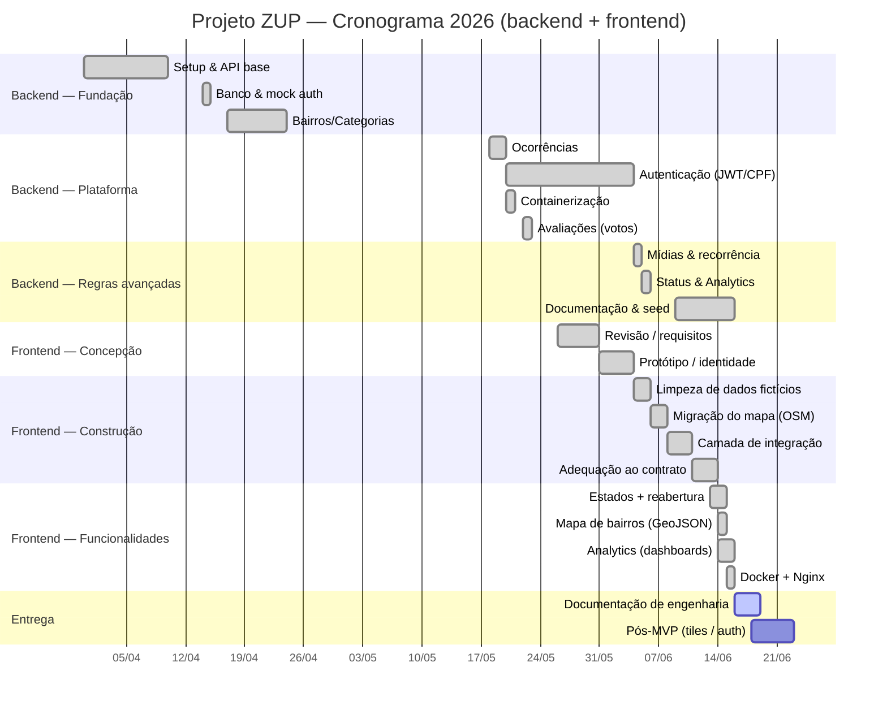

# 3. Plano de Projeto

> Planejamento e andamento do **projeto ZUP como um todo** — backend (API REST `ProjetoZup`) e
> frontend (`ZUP X` / `ProjetoZupFront`). O estado atual reflete o código dos dois repositórios.

## 3.1 Escopo e objetivos

**Objetivo geral:** disponibilizar uma plataforma cívica de **Zeladoria Urbana Participativa** para
o município de **Videira (SC)**, centralizando o registro georreferenciado e o acompanhamento de
problemas urbanos (buracos, iluminação, lixo, saneamento etc.) e aproximando a população da
administração municipal.

**Objetivos específicos:**

- Permitir o registro de ocorrências com **geolocalização** e **anexo de mídia**.
- Reduzir spam/duplicidade via **prevenção por raio geográfico** e visualização prévia de
  ocorrências próximas.
- Modelar o **ciclo de vida** da ocorrência com **máquina de estados** e trilha de auditoria.
- Registrar **reincidência/reabertura** de problemas.
- Oferecer **leitura por bairro** e **dashboards de transparência** (tempos, pendências, mapa de
  calor, eficiência por órgão).
- Garantir **segurança e privacidade** dos dados do cidadão (CPF, senha, tokens).
- Entregar uma **interface web** (mapa interativo Leaflet/OSM, registro guiado, painéis por perfil)
  que consuma o contrato real da API com uma camada de integração desacoplada e configurável.

**Divisão de responsabilidade entre os repositórios:** o **backend** define e valida as regras de
negócio (geofencing, duplicidade, autorização por papel, elegibilidade de validação) e expõe o
contrato OpenAPI; o **frontend** implementa a experiência do usuário e consome esse contrato.

## 3.2 Equipe e responsabilidades

| Frente | Responsáveis | Responsabilidade |
|--------|--------------|------------------|
| Backend / Banco de dados | Eduardo Fritsch Silva | API Express em camadas, modelagem PostGIS, autenticação, analytics, Docker, contrato OpenAPI. |
| Frontend | Lucas Costa e Silva, Eduardo Fritsch Silva | Aplicação React, mapa Leaflet/OSM, telas, painéis e integração com a API. |
| Documentação | Eduardo Fritsch Silva, Benvindo Domingos | Manutenção das regras e requisitos e levantamento do que precisa ser documentado. |
| Artigo | Eduardo Fritsch Silva, Lucas Costa e Silva | Escrita e adequação do artigo que formaliza o projeto. |

## 3.3 Gestão de versão

- **Versionamento:** Git + GitHub, branch principal `main` em ambos os repositórios.
- **Branches de feature:** o histórico do backend mostra branches dedicadas (ex.: `featureReopen`,
  `featureMidias`) integradas por merge.
- **Rastreabilidade de issues:** commits encerram issues com keywords (`Closes #1`, `Closes #8`…),
  ligando entrega ao backlog do GitHub.
- **Revisão:** fluxo de Pull Request para integração à `main`, com revisão por par.
- **Pontos de plugagem futura** no front são marcados no código com `TODO(API)`.

## 3.4 Cronograma / fases

### Backend (mar–jun/2026)

Reconstruído a partir do histórico de commits.

| Fase | Período | Entregáveis | Estado |
|------|---------|-------------|:------:|
| F1 — Setup & API base | 31/03 – 10/04 | Node, dependências, Express base | ✅ |
| F2 — Banco & mock auth | 14/04 | Inicialização do banco, `mockAuth` para testes | ✅ |
| F3 — Domínio base | 17/04 – 24/04 | Endpoints de bairros, categorias, subcategorias; coleção OpenAPI | ✅ |
| F4 — Ocorrências | 18/05 | CRUD de ocorrências + geolocalização | ✅ |
| F5 — Autenticação | 20/05 – 04/06 | `/auth` (JWT), usuários/perfil, **login por CPF** | ✅ |
| F6 — Containerização | 20/05 – 21/05 | Docker / Docker Compose (dev e prod) | ✅ |
| F7 — Engajamento | 22/05 | Avaliações (votos) e recálculo de score | ✅ |
| F8 — Mídias & recorrência | 04/06 | Upload de mídias, reabertura encadeada, janela de edição | ✅ |
| F9 — Status & analytics | 05/06 | Máquina de estados + histórico, slugs, **módulo de analytics**, `/organizations` | ✅ |
| F10 — Documentação & seed | 09/06 – 16/06 | README, dump/seed do banco, **backup sanitizado** para repo público | ✅ |
| F11 — Documentação de engenharia | 16/06 | Documentação (regras, requisitos, plano, permissões, ER, diagramas) | 🟡 em andamento |

### Frontend (maio–jun/2026)

| Fase | Período | Entregáveis | Estado |
|------|---------|-------------|:------:|
| F1 — Concepção | 26/05 | Revisão teórica e requisitos | ✅ |
| F2 — Protótipo / identidade visual | 31/05 | Identidade visual (Figma) e telas-base | ✅ |
| F3 — Limpeza de dados fictícios | 04/06 | Front sem dados fictícios (Lovable); domínio isolado em `mockData.ts` | ✅ |
| F4 — Migração do mapa | 06/06 | Google Maps → Leaflet/OSM | ✅ |
| F5 — Camada de integração | 08/06 | `lib/*-api` por domínio | ✅ |
| F6 — Adequação ao contrato real | 11/06 | GeoJSON `[lng,lat]`, ids numéricos, taxonomia viva, mídia multipart | ✅ |
| F7 — Máquina de estados + reabertura | 13/06 | 9 estados, transições/409, reabertura | ✅ |
| F8 — Mapa de bairros (GeoJSON real) | 14/06 | Contorno por GeoJSON real e geocoding via `/neighborhoods/locate` | ✅ |
| F9 — Analytics (dashboards reais) | 14/06 | Dashboards consumindo `/analytics/*` | ✅ |
| F10 — Docker + Nginx | 15/06 | Deploy desacoplado (proxy `/api` + SPA fallback) | ✅ |
| F11 — Documentação de entrega | 16/06 | Documentação do front | 🟡 em andamento |
| F12 — Pós-MVP | 18/06+ | Troca de tiles / endurecimento de auth | ⛔ planejado |

### Gantt consolidado (Mermaid)

## 3.5 Marcos (milestones)

| Marco | Data | Critério de conclusão |
|-------|------|-----------------------|
| M1 — API navegável | 24/04 | Bairros, categorias e subcategorias respondendo via HTTP |
| M2 — Ocorrências georreferenciadas | 18/05 | Criar/listar ocorrências com PostGIS |
| M3 — Plataforma autenticada | 04/06 | Login por CPF, JWT, perfis e mídias |
| M4 — Transparência | 05/06 | Máquina de estados + dashboards de analytics (back) |
| M5 — Front integrado | 14/06 | Mapa Leaflet/OSM, contrato real, estados, bairros e analytics consumidos |
| M6 — Pronto para demonstração | 16/06 | Backup sanitizado + README + seed reprodutível; front com deploy Docker/Nginx |
| M7 — Documentação de entrega | — | Documentação consolidada (back + front) revisada e aprovada |

## 3.6 Estado atual

**Pronto (✅) — Backend:**
- Modelagem geoespacial dos bairros (fronteiras, ponto central) e geofencing por point-in-polygon.
- Schema das tabelas principais restaurável via dump; autenticação real por **CPF + JWT**
  (access/refresh) com recuperação de senha e rate limiting.
- Ocorrências: criação com anti-duplicidade e geofencing, edição com janela de 24 h, máquina de
  estados com histórico, reabertura encadeada, upload de mídias, votação.
- Módulo de **analytics** (RF-22 a RF-25) sobre views base (`v_occurrence_metrics`,
  `v_heatmap_points`); containerização (Docker Compose dev/prod); OpenAPI 3.0 (`openapi.json`).
- **Exclusão de ocorrência** restrita ao autor (janela de 24 h) ou admin; criação não aceita mais
  `status` no corpo (toda ocorrência nasce `pending`).

**Pronto (✅) — Frontend:**
- Limpeza do front e modelo de domínio isolado; mapa Leaflet/OSM, heatmap, contorno real de bairros.
- Camada de integração completa por domínio (`auth`, `occurrences`, `categories`, `organizations`,
  `neighborhoods`, `evaluations`, `analytics`); autenticação CPF + JWT com refresh automático.
- Máquina de estados (9), transições/409, reabertura/reincidência; taxonomia viva; dashboards
  analíticos reais; deploy via Docker/Nginx.

**Em transição / parcial (🟡):**
- **Autorização por papel nas transições de status:** hoje a transição exige apenas `auth`; a
  segregação por papel (`agent`/`admin`) acompanhará a evolução do módulo do agente. O gating do
  front é, até lá, cosmético.
- **Relevância/priorização por votação** (RN-16): a votação já existe; falta a lógica que liga
  relevância → validação → fila de prioridade. `priority` não existe no backend (front fixa `media`).
- `mockAuth` (`USE_MOCK_AUTH`) ainda presente como atalho de desenvolvimento.
- **Suporte (contato)** e **notificações**: UI pronta/placeholder, à espera de endpoints no backend.

## 3.7 Roadmap / backlog

Itens decorrentes das divergências e lacunas levantadas na documentação (back + front):

| # | Item | Origem |
|---|------|--------|
| R-01 | **Validação por relevância (votação):** promover a ocorrência ao ultrapassar uma taxa aceitável de upvotes/downvotes | RN-16 / RF-35 |
| R-02 | **Definir a lógica de relevância e priorização** (taxa de validação, fórmula da fila) — requer análise mais aprofundada | RN-16 / RN-11 |
| R-03 | **Segregar transições de status por papel** (`agent`/`admin` nos estados operacionais), com `requireRole` nas rotas; elimina o gating cosmético do front | RN-05 / RF-12 |
| R-04 | **Fluxo de atribuição de órgão** (`assigned_organization_id`) pós-criação; e **vínculo agente→organização** no backend, eliminando a derivação legada por slug no front | RN-17 / RF-27 |
| R-05 | **Geofencing como bloqueio** ao território de Videira (hoje só deriva o bairro) | RN-03 / RF-37 |
| R-06 | **Priorização por votação** (ordenar/filtrar por `score`); adicionar campo/regra de prioridade | RN-11 / RF-36 |
| R-07 | **Notificações** ao autor em mudança de status (endpoint + consumo no front) | RF-38 |
| R-08 | Substituir `mockAuth` por fluxo real em todos os ambientes | F2/F5 |
| R-09 | **Migrations versionadas** + DDL em texto (`db/schema.sql`) com índices e FKs explícitos | RNF-B01 |
| R-10 | **Testes automatizados** e **pipeline CI/CD** (back + front) | RNF |
| R-11 | Versionar o SQL das views de analytics (`db/analytics_views.sql`) | analytics |
| R-12 | Rate limiter dedicado e cache/TTL nos endpoints públicos de analytics | analytics |
| R-13 | Remover tabelas de staging (`bairros_raw`, `staging_bairros_sc`) do backup público | modelo de dados §7 |
| R-14 | **Troca do provedor de tiles** (MapTiler/Stadia/Carto/self-host) antes de produção | RNF-F10 |
| R-15 | **Endpoint de envio do formulário de suporte/contato** | RF-32 |

> **Já concluídos** (saíram do roadmap): restrição da exclusão de ocorrência a autor/admin com
> janela de 24 h (RN-10), e remoção do `status` do corpo de criação.
>
> **Validação comunitária e priorização passam a ser feitas por votação.** O modelo original previa
> um papel "Validador" com elegibilidade por bairro/adjacência; o caminho adotado é mais simples —
> usar a **relevância apurada pelos votos** (R-01/R-02). Isso ainda requer uma análise mais
> aprofundada para fechar a lógica (taxa de validação e fórmula de priorização).
