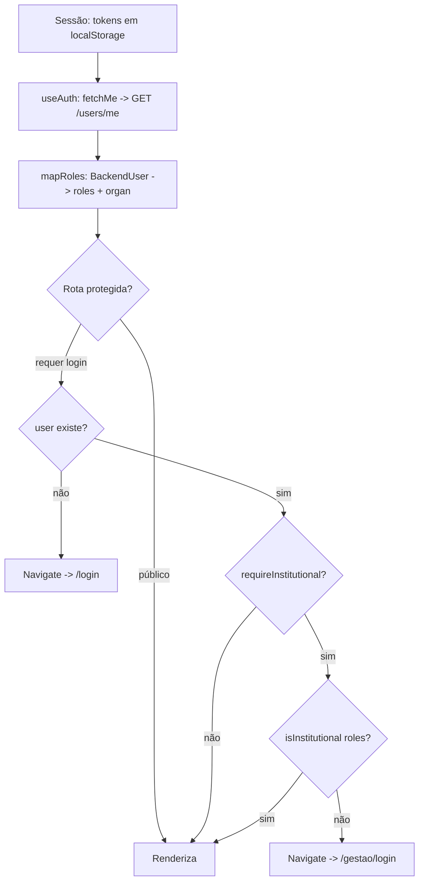

# 4. Perfis e Permissões

> Papéis do sistema e o que cada um pode fazer. A autorização **definitiva é do backend**
> (middlewares `auth`/`requireRole` + checagem de *ownership* no service). O frontend trabalha com um
> modelo de perfis mais rico (para a UI) e aplica um **gating no cliente** que, em algumas ações,
> ainda é apenas visual. Este documento descreve os papéis, o mapeamento back↔front e as matrizes de
> permissão **real** (o que o servidor aplica hoje), **de UI** (o que o front mostra) e **pretendida**
> (o modelo de negócio alvo).

## 4.1 Papéis

### No backend (fonte da verdade)

O papel é o enum `user_role` na coluna `users.role`. O cadastro cria sempre `citizen`; a troca de
papel é feita por admin via `PATCH /users/:id/role`. São **3 papéis**:

| Papel | Descrição |
|-------|-----------|
| **`citizen`** (Cidadão) | Padrão no cadastro. Registra ocorrências, anexa mídias, vota, edita/exclui as próprias ocorrências (dentro da janela de 24 h), acompanha status e dashboards públicos. |
| **`agent`** (Agente público) | Existe no enum. **Atuará** na triagem e no andamento operacional das ocorrências. 📌 Ver observação abaixo. |
| **`admin`** (Administrador) | Acesso total: gerencia categorias/subcategorias, usuários e papéis, e acessa analytics restritos de órgãos. É também "super-editor" de qualquer ocorrência. |

> 📌 **O papel `agent` ainda não tem permissões próprias no código.** Nenhuma rota usa
> `requireRole('agent')`, então hoje um `agent` tem as mesmas permissões de um `citizen`. Esse papel
> **será desenvolvido** à medida que o módulo principal — voltado à comunidade e ao registro público
> das ocorrências — evoluir; é nessa frente que entram a triagem e a transição dos estados
> operacionais ([Roadmap R-03](./03-plano-de-projeto.md)).

> 📌 **Não há papel "Validador".** O modelo original previa um Validador (cidadão elegível que
> confirma ocorrências do seu bairro, com elegibilidade por adjacência). O projeto **abandonou esse
> caminho** em favor de **validação por relevância via votação** (RN-16): não haverá papel Validador;
> a promoção da ocorrência decorrerá da taxa de upvotes/downvotes. A tabela `neighborhood_adjacency`
> permanece reservada no schema, sem uso.

### No frontend (modelo de UI)

O front trabalha com **5 perfis** (`AppRole` em `src/hooks/useAuth.tsx`):
`cidadao`, `prefeitura`, `agua_saneamento`, `energia_luz`, `admin`. Eles existem para expressar os
**órgãos** na interface; são derivados do papel do backend.

### Mapeamento back → front (`mapRoles`, `auth-api.ts`)

| Papel backend | Perfil(is) front | `organ` |
|---------------|------------------|---------|
| `admin` | `admin` | — |
| `agent` | `prefeitura` | `prefeitura` |
| `citizen` | `cidadao` | — |

> No servidor, o papel vem direto de `users.role` no payload do JWT (`auth.js`, `authService`),
> **sem** vínculo agente→organização. Por isso todo `agent` cai em `prefeitura` no front. Os perfis
> `agua_saneamento`/`energia_luz` existem **apenas** no modelo de UI e nenhum usuário real é mapeado
> para eles hoje — dependeriam de o backend expor o órgão do agente (ver
> [Roadmap R-04](./03-plano-de-projeto.md)).

**Agrupamento "institucional".** `isInstitutional(roles)` = qualquer um de `prefeitura`,
`agua_saneamento`, `energia_luz`, `admin` (`useAuth.tsx`). É o que libera as rotas internas e os
controles de gestão no front.

## 4.2 Matriz de permissões — estado real (backend)

Legenda: ✓ permitido · ✗ negado · 👤 só o **autor** do recurso (User criador) · 🌐 público (sem autenticação).
A coluna reflete **exatamente** o que os middlewares (`auth`, `requireRole`) e os controllers
aplicam hoje.

| Ação | Endpoint | Público | Cidadão | Agente | Admin |
|------|----------|:-------:|:-------:|:------:|:-----:|
| Healthcheck | `GET /health` | 🌐 | ✓ | ✓ | ✓ |
| Cadastrar-se / login / refresh | `POST /auth/*` | 🌐 | ✓ | ✓ | ✓ |
| Recuperar senha | `POST /auth/forgot\|reset-password` | 🌐 | ✓ | ✓ | ✓ |
| Ver/editar próprio perfil | `GET\|PATCH /users/me` | ✗ | ✓ | ✓ | ✓ |
| Listar/detalhar usuários | `GET /users`, `GET /users/:id` | ✗ | ✗ | ✗ | ✓ |
| Alterar papel de usuário | `PATCH /users/:id/role` | ✗ | ✗ | ✗ | ✓ |
| Listar/detalhar ocorrências | `GET /occurrences`, `/:id`, `/nearby` | 🌐 | ✓ | ✓ | ✓ |
| Registrar ocorrência | `POST /occurrences` | ✗ | ✓ | ✓ | ✓ |
| Editar ocorrência (janela 24 h) | `PATCH /occurrences/:id` | ✗ | 👤 | 👤 | ✓ |
| Excluir ocorrência (autor: janela 24 h) | `DELETE /occurrences/:id` | ✗ | 👤 | 👤 | ✓ |
| **Transição de status** | `PATCH /occurrences/:id/status` | ✗ | 👤 | ✓ | ✓ |
| Anexar/remover mídia | `POST\|DELETE /occurrences/:id/media` | ✗ | 👤 | 👤 | ✓ |
| Reabrir ocorrência | `POST /occurrences/:id/reopen` | ✗ | 👤 | ✓ | ✓ |
| Ver histórico de status / reaberturas | `GET …/status-history`, `…/reopens` | 🌐 | ✓ | ✓ | ✓ |
| Votar / remover voto | `POST …/upvote\|downvote`, `DELETE …/vote` | ✗ | ✓ | ✓ | ✓ |
| Listar votos da ocorrência | `GET /occurrences/:id/evaluations` | ✗ | ✓ | ✓ | ✓ |
| Listar bairros / geofencing | `GET /neighborhoods*` | 🌐 | ✓ | ✓ | ✓ |
| Listar/detalhar categorias/subcategorias | `GET /categories*`, `/subcategories*` | 🌐 | ✓ | ✓ | ✓ |
| Criar/editar/excluir categorias/subcategorias | `POST\|PATCH\|DELETE /categories*`, `/subcategories*` | ✗ | ✗ | ✗ | ✓ |
| Listar órgãos | `GET /organizations` | 🌐 | ✓ | ✓ | ✓ |
| Analytics públicos | `GET /analytics/overview\|by-neighborhood\|heatmap\|response-time` | 🌐 | ✓ | ✓ | ✓ |
| Analytics por órgão | `GET /analytics/by-organization` | ✗ | ✗ | ✗ | ✓ |

**Notas sobre a matriz real:**

- ✅ **`DELETE /occurrences/:id`** é restrito: apenas o **autor** (dentro da janela de 24 h) ou um
  **admin** podem excluir; terceiros recebem **403**. Alinhado com a edição (RN-10).
- ✅ **`POST /occurrences`** não aceita mais `status` no corpo — toda ocorrência nasce `pending`. O
  campo `assigned_organization_id` **continua aceito de propósito**: ainda não existe um fluxo que
  defina/troque o órgão responsável, então a atribuição na criação é a única forma disponível hoje
  (R-04 prevê o fluxo dedicado).
- ✅ **`PATCH /occurrences/:id/status`** e **`POST /occurrences/:id/reopen`** exigem `auth` e são
  liberados ao **User criador** (autor da ocorrência), ao **agente** e ao **admin**. As transições e
  reaberturas ficam restritas a esses perfis.

## 4.3 Matriz Perfil × Ação — visão da UI (frontend)

> ✓ = liberado na UI · ✗ = oculto/bloqueado na UI.

| Ação | Cidadão | Órgão (prefeitura/água/energia) | Admin |
|------|:------:|:------:|:-----:|
| Registrar ocorrência | ✓ | ✓ | ✓ |
| Anexar mídia | ✓ | ✓ | ✓ |
| Ver ocorrências próximas (nearby) | ✓ | ✓ | ✓ |
| Votar (up/down) / remover voto | ✓ | ✓ | ✓ |
| Acompanhar status + histórico | ✓ | ✓ | ✓ |
| Editar/excluir **a própria** ocorrência | ✓ (autor) | ✓ (autor) | ✓ |
| Alterar status operacional | ✓ (autor) | ✓ | ✓ |
| Reabrir ocorrência (reincidência) | ✓ (autor) | ✓ | ✓ |
| Acessar painel de gestão / institucional | ✗ | ✓ | ✓ |
| Acessar dashboards de gestão | ✗ | ✓ | ✓ |
| Estatística por órgão (`/analytics/by-organization`) | ✗ | ✓ (auth) | ✓ (auth) |
| Listar usuários (`GET /users`) | ✗ | ✗ | ✓ |

**Notas da matriz de UI.**
- A coluna "Validador" é omitida de propósito: validação é por **voto de cidadão**, não papel
  (ver §4.1).

## 4.4 Matriz pretendida (modelo de negócio, roadmap)

Para referência, a matriz **alvo** segregaria os estados operacionais, com a validação decidida por
**votação da comunidade** (relevância), não por um papel dedicado:

| Ação | Cidadão | Órgão (`agent`) | Admin |
|------|:------:|:---------------:|:-----:|
| Registrar ocorrência | ✓ | ✓ | ✓ |
| Votar (alimenta a validação por relevância) | ✓ | ✓ | ✓ |
| Validar existência | *por votação (RN-16)* | ✗ | ✓ |
| Alterar status operacional | ✗ | ✓ | ✓ |
| Validar/rejeitar resolução | ✓¹ | ✗ | ✓ |
| Excluir ocorrência | 👤 | ✗ | ✓ |
| Acessar dashboards de gestão | ✗ | ✓ | ✓ |
| Gerenciar usuários/categorias | ✗ | ✗ | ✓ |

> ¹ A validação da resolução tende a combinar o **autor** e a **relevância da comunidade**; a regra
> exata será definida junto com RN-16.

## 4.5 Como a autorização é aplicada

### No backend (definitiva)

A autorização é feita por **middlewares de rota** (Express), na ordem em que são encadeados:

1. **`auth`** (`src/middlewares/auth.js`) — exige um JWT **válido do tipo `access`** no header
   `Authorization: Bearer <token>`. Decodifica e injeta `req.user = { id, name, email, role }`.
   Sem token / token inválido / expirado → **401**.
   - Atalho de desenvolvimento: se `USE_MOCK_AUTH=true`, `auth` delega para `mockAuth`, que injeta um
     **usuário admin fake** sem exigir token. **Nunca usar em produção.**
2. **`optionalAuth`** (`src/middlewares/optionalAuth.js`) — popula `req.user` **se** houver token,
   mas **não bloqueia** rotas públicas. Usado em `GET /occurrences/:id` para informar `voted_user`.
3. **`requireRole(...papéis)`** (`src/middlewares/requireRole.js`) — exige `req.user` e que
   `req.user.role` esteja na lista; senão **403 `Forbidden`** (ou **401** se não autenticado).
   No código atual, é usado **apenas com `'admin'`**.
4. **Autorização de recurso (ownership)** — feita no **service**, não em middleware: por exemplo
   `occurrencesService.assertCanEdit` permite editar somente se `author_id === user.id` **ou**
   `role === 'admin'` (RN-10).

### No frontend (gating de cliente)

- **Sessão.** Tokens (`zup_access_token`, `zup_refresh_token`) em `localStorage`; toda chamada
  autenticada injeta `Authorization: Bearer` e renova em 401 (`src/lib/api.ts`).
- **Contexto de auth.** `AuthProvider`/`useAuth` carrega `users/me`, deriva `roles`/`organ` e expõe
  `signOut`/`refreshRoles` (`src/hooks/useAuth.tsx`).
- **Guarda de rota.** `ProtectedRoute`: sem `user` → redireciona para `/login`; `requireInstitutional`
  e não institucional → redireciona para `/gestao/login`.
- **Gating de ação.** Componentes sensíveis checam o papel (ex.: `StatusControl` só renderiza para
  institucionais). As ações de status/reabertura ficam restritas, no servidor, ao **User criador**,
  ao **agente** e ao **admin**.

## 4.6 Validação por relevância (votação) *(Roadmap)*

> 📌 A validação de uma ocorrência **não** dependerá de um papel "Validador" nem de elegibilidade por
> bairro/adjacência, e sim da **relevância apurada por votação** (RN-16): ao ultrapassar uma **taxa
> aceitável** de upvotes/downvotes, a ocorrência é promovida a `validated`. A votação já funciona
> (RN-11); falta implementar a regra que liga relevância → validação → priorização. Os parâmetros
> (taxa de aprovação, fórmula da fila de prioridade) ainda serão definidos (ver R-01, R-02).
>
> No servidor, a tabela `neighborhood_adjacency` existe (PK composta `(neighborhood_id, neighbor_id)`,
> CHECK de não-reflexividade, FKs `ON DELETE CASCADE`) e era a base reservada para a elegibilidade por
> adjacência, mas **nenhum código a utiliza**. O usuário já é associado a um bairro (`neighborhood_id`
> no cadastro/perfil), insumo que poderia alimentar regras futuras.
