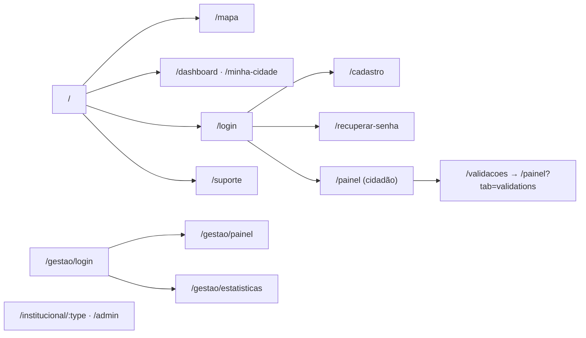

# 6. Documentação Técnica do Frontend

> O frontend é a aplicação web **ZUP X** (React 18 + Vite 5 + TypeScript), mantida em repositório
> próprio (<https://github.com/Grogww/ProjetoZupFront>) e que consome a API **ProjetoZup** como fonte
> da verdade. Esta seção descreve a aplicação por dentro — estrutura de código, telas e, em especial,
> a camada visual (identidade, design system e UX). As regras de negócio e os requisitos têm
> tratamento próprio em [01-regras-de-negocio.md](./01-regras-de-negocio.md) e
> [02-requisitos.md](./02-requisitos.md); o contrato de API consumido está em
> [08-api-e-contrato.md](./08-api-e-contrato.md).

## 6.1 Stack

- **React 18** + **TypeScript** + **Vite 5** (`@vitejs/plugin-react-swc`).
- **React Router** (`react-router-dom`) — rotas; **TanStack Query** (`@tanstack/react-query`) —
  cache e estado de servidor.
- **Tailwind CSS** + **shadcn/ui** (componentes sobre **Radix UI**) + **lucide-react** (ícones) +
  **framer-motion** (animações).
- **Leaflet** + **react-leaflet** + **leaflet.heat** — mapa e mapa de calor.
- **react-hook-form** + **zod** — formulários e validação.
- **Recharts** — gráficos de analytics; **sonner** — toasts; **react-helmet-async** — SEO.
- **Plus Jakarta Sans** — tipografia base (fonte da identidade).
- Build/deploy via **Docker** (`Dockerfile`, `nginx.conf`, `docker-compose.yml`).

## 6.2 Estrutura do projeto

```
src/
├── main.tsx            # Bootstrap (HelmetProvider) + CSS do Leaflet
├── App.tsx             # Providers (QueryClient, Theme, Tooltip, Auth) e rotas
├── index.css           # Tokens de tema (CSS variables) — paleta clara/escura
├── pages/              # Uma página por rota (Index, MapPage, Dashboard, Login, Gestao…)
├── components/         # Componentes de domínio (MapView, ReportCard, StatusControl…)
│   ├── ui/             # Primitivos do shadcn/ui (Radix) — design system (49 arquivos)
│   ├── layout/         # Navbar / casca da aplicação
│   └── support/        # Suporte/FAQ (FAB, formulário, footer)
├── hooks/              # useAuth, useOccurrences, useStats, useTaxonomy, useTheme…
├── lib/                # Cliente HTTP e módulos de API (auth, occurrences, analytics…)
├── data/               # Tipos e configs de domínio (status, órgãos, FAQ)
├── assets/             # Imagens estáticas
└── vendor/leaflet/     # CSS do Leaflet vendorizado (sem dependência de CDN)
```

## 6.3 Estrutura de componentes

| Grupo | Componentes | Papel |
|-------|-------------|-------|
| Mapa | `MapView`, `MapLegend`, `useNeighborhoodBoundaries` | Mapa Leaflet, legenda por status, contorno de bairros |
| Registro/Detalhe | `CreateReportModal`, `ReportDetailModal`, `ReportCard`, `ReportImage` | Fluxo de registro (4 passos), detalhe, listagem |
| Status | `StatusControl`, `StatusBadge`, `PriorityBadge` | Mudança de status/reabertura e selos |
| Layout/navegação | `layout/Navbar`, `NavLink`, `HeroCarousel`, `OnboardingModal`, `Seo` | Casca da aplicação |
| Acesso | `ProtectedRoute` | Guarda de rotas |
| Suporte | `support/ContactForm`, `ContactInfo`, `FaqAccordion`, `SupportFab`, `SupportFooter` | Suporte/FAQ |
| Robustez | `ErrorBoundary` | Captura de erros de render |
| **UI base** | `components/ui/*` | **Reutilizáveis** (shadcn/ui sobre Radix): button, dialog, select, table, tabs, toast, etc. |

Os componentes em `components/ui/` são a **biblioteca reutilizável** (design system) e não contêm
regra de negócio.

## 6.4 Mapa de navegação / rotas

Definidas em `src/App.tsx`. Rotas protegidas passam por `ProtectedRoute` (exige sessão;
`requireInstitutional` restringe a perfis institucionais — ver [04-perfis-e-permissoes.md](./04-perfis-e-permissoes.md)).

| Rota | Página | Acesso | Consome (API) |
|------|--------|--------|---------------|
| `/` | `Index` (landing) | Público | — |
| `/mapa` | `MapPage` | Público | `GET /occurrences`, `/neighborhoods`, `/categories`, `/analytics/heatmap` |
| `/dashboard`, `/minha-cidade` | `Dashboard` | Público | `GET /analytics/*`, `/neighborhoods/:id/occurrences` |
| `/login` | `Login` | Público | `POST /auth/login`, `/auth/refresh` |
| `/cadastro` | `Register` | Público | `POST /auth/register` |
| `/recuperar-senha` | `ForgotPassword` | Público | `POST /auth/forgot-password`, `/auth/reset-password` |
| `/painel` | `CitizenPanel` | Autenticado | `GET /occurrences?author_id=`, `/users/me`, votos |
| `/validacoes` | → redireciona para `/painel?tab=validations` | Autenticado | — |
| `/institucional/:type`, `/admin` | `InstitutionalPanel`/`AdminPanel` | Institucional | ocorrências, status, `GET /users`, analytics |
| `/gestao`, `/gestao/login` | `Gestao`/`GestaoLogin` | Público / login | `POST /auth/login` |
| `/gestao/painel` | `GestaoPanel` | Institucional | `GET /occurrences`, `PATCH …/status` |
| `/gestao/estatisticas` | `GestaoEstatisticas` | Institucional | `GET /analytics/*` |
| `/suporte` | `Support` | Público | — |
| `*` | `NotFound` | — | — |



> O **detalhe** e o **registro** de ocorrência são abertos como **modais** (`ReportDetailModal`,
> `CreateReportModal`) sobre o mapa — não como rotas próprias.

## 6.5 Papéis no frontend e mapeamento com o backend

O backend tem três papéis (`citizen | agent | admin`). O front trabalha com um modelo mais rico de
perfis e **órgãos** e faz a tradução em `lib/auth-api.ts → mapRoles` (detalhes em
[04-perfis-e-permissoes.md §4.1](./04-perfis-e-permissoes.md)):

| Papel no backend | Perfil no frontend | Observação |
|------------------|--------------------|------------|
| `citizen` | `cidadao` | Acesso ao painel do cidadão. |
| `agent` | `prefeitura` (institucional) | O backend ainda **não vincula agente a um órgão**, então todo `agent` é tratado como Prefeitura. |
| `admin` | `admin` | Acesso institucional total. |

Os **órgãos** previstos na UI (`data/organConfig.ts`) são **Prefeitura**, **Água e Saneamento
(VISAN)** e **Energia e Iluminação (CELESC)**. Como a atribuição agente→órgão ainda não existe no
backend ([Roadmap R-04](./03-plano-de-projeto.md)), os dois últimos ficam preparados na UI mas sem
origem no servidor. O acesso institucional é decidido por `isInstitutional(roles)`.

## 6.6 Gestão de estado e fluxo de dados

- **Estado de servidor:** **TanStack Query** é a fonte. Hooks por domínio (`useOccurrences`,
  `useTaxonomy`, `useStats`, `useNeighborhoodBoundaries`, `useSupportContact`) encapsulam
  `useQuery`/`useMutation` e entregam um **shape estável** à UI.
- **Mapeamento contrato → UI:** `mapOccurrenceToReport` converte `BackendOccurrence` em `Report`;
  `useOccurrences` enriquece com nome do bairro (taxonomia) e órgão derivado.
- **Invalidação:** mutações de status/reabertura invalidam `occurrences`, `occurrence-detail`,
  `status-history` e os recortes `analytics-*` (`useOccurrences.ts`).
- **Estado de autenticação:** Context `AuthProvider`/`useAuth` (usuário, papéis, órgão) sincronizado
  entre abas via evento `storage`.
- **Estado de UI local:** `useState` nos formulários (ex.: `CreateReportModal` controla passo,
  posição, arquivos) e `useTheme` para tema claro/escuro.

## 6.7 Integração com a API (cliente)

Toda a comunicação passa por um cliente HTTP central (`src/lib/api.ts`) — contrato detalhado em
[08-api-e-contrato.md](./08-api-e-contrato.md):

- **Base da API:** lida de `import.meta.env.VITE_API_BASE_URL` (ex.: `http://localhost:3000/api`) —
  **nunca** há URL fixa no código.
- **Tokens:** `access`/`refresh` em `localStorage` (`zup_access_token`, `zup_refresh_token`); o
  `access` é enviado como `Authorization: Bearer <token>`.
- **Refresh automático:** ao receber **401** numa rota autenticada, o cliente chama
  `POST /auth/refresh`, atualiza os tokens e **repete a requisição** uma vez (com de-duplicação de
  refreshes concorrentes). Se o refresh falhar, limpa a sessão.
- **Erros:** respostas de erro do backend (`{ error, details? }`) viram uma `ApiError` com `status` e
  `data`. Padrões na UI:
  - **409 `OCCURRENCE_DUPLICATE`** → aviso de ocorrência próxima usando `details.duplicate_id`/
    `distance_m` (`CreateReportModal`).
  - **409 transição inválida** → toast "Transição não permitida" (`StatusControl`).
  - Falha de upload de mídia → ocorrência preservada, aviso para reenviar.
- **Upload:** mídias enviadas como `multipart/form-data` no campo **`media`**.

Os módulos de `lib/` espelham os contratos do backend e adaptam ao modelo do front:
- **Geometria:** `location` chega como **GeoJSON Point** (`coordinates: [lng, lat]`); o front
  converte para `{ lat, lng }`.
- **Status:** normalizados para os **9 status reais** da máquina de estados; valores fora da lista
  caem para `pending`.
- **Mídias:** URLs relativas são prefixadas com a origem do backend (`resolveMediaUrl`).
- **Prioridade:** o backend não tem campo de prioridade; o front assume um valor padrão (`media`) até
  a **priorização por votação** (RN-16) existir.

### Rótulos de status exibidos na UI

`statusLabels` em `mockData.ts` traduz os **9 status reais** da máquina de estados do backend:

| Status (API) | Rótulo na UI |
|--------------|--------------|
| `pending` | Pendente |
| `awaiting_validation` | Aguardando Validação |
| `validated` | Validada pela Comunidade |
| `in_analysis` | Em Análise |
| `in_progress` | Em Execução |
| `resolved` | Resolvido pelo Órgão |
| `resolution_validated` | Resolução Validada |
| `resolution_rejected` | Resolução Rejeitada |
| `closed` | Encerrada |

## 6.8 Camada de mapa (Leaflet/OSM)

- **Tiles:** servidor público do OpenStreetMap (`OSM_URL` em `MapView.tsx`; URL equivalente em
  `Dashboard.tsx`), adequado a desenvolvimento e demonstração; um provedor com cota própria é
  recomendado para produção ([Roadmap R-14](./03-plano-de-projeto.md)).
- **Camadas:** marcadores de ocorrências (cor por status, `getStatusColor`), **contorno de bairros**
  (GeoJSON real via `useNeighborhoodBoundaries`, translúcido e `interactive: false` para o clique
  passar ao mapa) e **heatmap** (`leaflet.heat` no `Dashboard`, sobre `GET /analytics/heatmap`).
- **Registro por clique:** ao marcar o ponto, busca `nearby` (500 m) e mostra ocorrências próximas;
  o bairro é detectado por `GET /neighborhoods/locate`. O bloqueio de duplicidade é aplicado pelo
  backend (mesma categoria, ocorrência aberta, raio de 500 m — ver
  [01-regras-de-negocio.md](./01-regras-de-negocio.md), RN-03/RN-04).
- **CSS vendorizado:** `src/vendor/leaflet/leaflet.css` (cópia oficial) para evitar dependência de
  CDN.

## 6.9 Identidade visual e design system

A identidade é **clara, com primária em tons de roxo**, construída sobre **tokens HSL** em
`src/index.css` (CSS variables) e consumida pelo Tailwind + shadcn/ui. Trocar uma variável repinta
toda a aplicação — não há cor "solta" nos componentes.

### Tokens de cor (tema claro · `:root`)

| Token | Valor (HSL) | Uso |
|-------|-------------|-----|
| `--background` | `210 20% 98%` | Fundo da aplicação |
| `--foreground` | `260 20% 15%` | Texto principal |
| `--primary` | `262 60% 45%` | **Roxo** — ações, links, marca |
| `--accent` | `270 50% 55%` | Realce secundário |
| `--secondary` / `--muted` | `260 14% 93%` / `260 14% 95%` | Superfícies neutras |
| `--destructive` | `0 84% 60%` | Erros / ações destrutivas |
| `--border` / `--input` / `--ring` | `260 15% 89%` / `262 60% 45%` | Bordas, campos, foco |
| `--radius` | `0.625rem` (10px) | Raio padrão dos componentes |

No **tema escuro** (`.dark`) os mesmos tokens mudam para fundo `260 20% 8%` e primária `262 60% 55%`,
preservando o contraste e a cara roxa. Alternância via `useTheme` (`next-themes`).

### Cores por órgão (`data/organConfig.ts`)

| Órgão | `accentColor` (HSL) | Cor |
|-------|---------------------|-----|
| Prefeitura Municipal de Videira | `262 60% 45%` | Roxo |
| Água e Saneamento (VISAN) | `200 70% 45%` | Azul |
| Energia e Iluminação (CELESC) | `38 92% 50%` | Âmbar |

### Cores de status (`STATUS_COLORS` em `mockData.ts` · pins do mapa e selos)

| Status | Hex | Cor |
|--------|-----|-----|
| Pendente | `#9CA3AF` | Cinza |
| Aguardando Validação | `#A855F7` | Roxo claro |
| Validada pela Comunidade | `#8B5CF6` | Roxo |
| Em Análise | `#EAB308` | Amarelo |
| Em Execução | `#0D9488` | Teal |
| Resolvido pelo Órgão | `#22C55E` | Verde |
| Resolução Validada | `#16A34A` | Verde-escuro |
| Resolução Rejeitada | `#EF4444` | Vermelho |
| Encerrada | `#6B7280` | Cinza-escuro |

`getStatusColor` alimenta os pins SVG no mapa, a `MapLegend` e o `StatusBadge`, garantindo a mesma
linguagem de cor em mapa, listagem e detalhe.

### Tipografia, animação e ícones

- **Tipografia:** `Plus Jakarta Sans` (corpo e títulos `h1–h6`), declarada em `index.css` e
  registrada em `tailwind.config.ts` (`fontFamily.sans`).
- **Animações** (Tailwind + `tailwindcss-animate`): `fade-in` (0.5s, sobe 10px), `slide-up`
  (0.6s, sobe 20px) e `accordion-down/up` (0.2s); micro-interações pontuais com **framer-motion**.
- **Ícones:** `lucide-react`, traço fino, alinhados à grade dos componentes shadcn/ui.

## 6.10 Acessibilidade e UX

- **Componentes acessíveis** por padrão via shadcn/ui sobre **Radix UI** (foco, navegação por
  teclado, `aria-*` em dialog/select/tabs/accordion).
- **Feedback:** toasts com **sonner** (sucesso/erro de registro, mudança de status, envio de mídia).
- **Robustez de UI:** `ErrorBoundary` captura erros de render e evita tela branca.
- **Onboarding:** `OnboardingModal` e `HeroCarousel` apresentam o produto na primeira visita.
- **Suporte sempre à mão:** FAB persistente (`support/SupportFab`) com formulário e FAQ.
- **SEO por página:** `react-helmet-async` via `components/Seo.tsx`.

## 6.11 Validação no cliente

`src/lib/validators.ts`: `validateCPF` (dígitos verificadores), `formatCPF`, `validateCEP`,
`formatCEP`, `validatePhone`, `formatPhone`. Formulários usam **react-hook-form + zod**. A validação
no cliente é conveniência de UX; a validação canônica é a do backend (ver RN-01).
