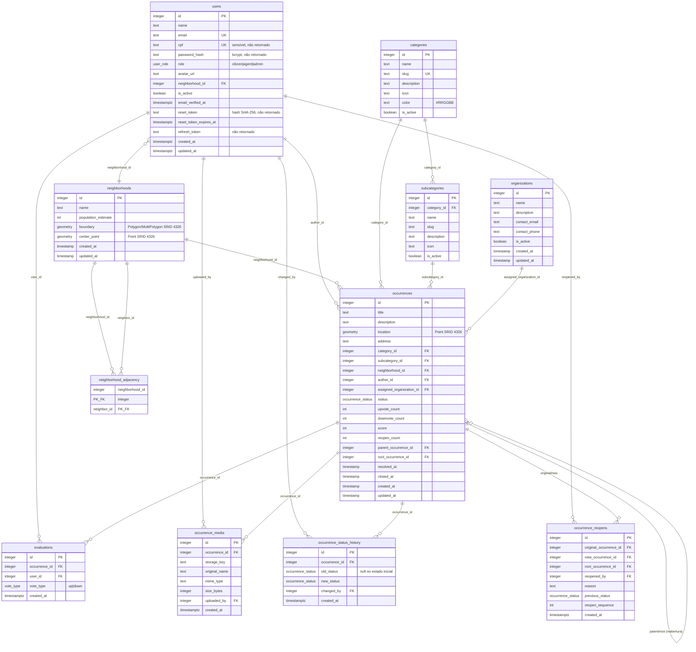

# 7. Modelo de Dados

> O esquema físico é **definido no backend** (PostgreSQL + PostGIS) e restaurado a partir de
> `db/init/zup_backup.backup` (dump binário), verificado via `pg_restore --schema-only`. O
> **frontend não possui banco** — consome um **subconforme do contrato** reconstruído das interfaces
> TypeScript em `src/lib/*-api.ts` (ver §7.5). Recomenda-se versionar o DDL em texto
> (`db/schema.sql`) para auditar constraints e índices sem depender do dump
> ([Roadmap R-09](./03-plano-de-projeto.md)).

## 7.1 Diagrama ER (schema do backend)



**Constraints confirmadas no DDL** (extraído do dump): chaves `integer`; `users.email`,
`users.cpf`, `categories.name`, `categories.slug` e `neighborhoods.name` **únicos**;
`evaluations` com **UNIQUE `(occurrence_id, user_id)`** (`uq_evaluations_occurrence_user`);
`subcategories` único por `(category_id, name)` e `(category_id, slug)`;
`occurrence_reopens.new_occurrence_id` único; `neighborhood_adjacency` com PK composta
`(neighborhood_id, neighbor_id)` e CHECK `neighborhood_id <> neighbor_id`. Geometrias tipadas:
`occurrences.location geometry(Point,4326) NOT NULL`, `neighborhoods.boundary
geometry(MultiPolygon,4326)`, `neighborhoods.center_point geometry(Point,4326)`.

> 📌 **`neighborhood_adjacency` existe no schema** (PK `(neighborhood_id, neighbor_id)`, CHECK de
> não-reflexividade, ambas as FKs `ON DELETE CASCADE` para `neighborhoods`), mas **nenhum código
> a utiliza**. Era a base da validação comunitária por adjacência prevista originalmente; como o
> projeto passou a adotar **validação/priorização por votação** (RN-16), esta tabela ficou
> **reservada** — pode ser reaproveitada no futuro, mas não é mais pré-requisito de nenhuma regra
> ativa.

> ⚠️ **Tabelas de staging no dump:** o backup ainda contém `bairros_raw` e `staging_bairros_sc`
> (geometria `MultiPolygon,4326`, com índice GiST) — resíduos do ETL de importação dos bairros de
> Santa Catarina. **Recomenda-se removê-las do backup público** ([R-13](./03-plano-de-projeto.md)).
> A extensão `uuid-ossp` também está presente, embora as PKs sejam `integer` sequenciais.

## 7.2 Tabelas centrais

| Tabela | Papel |
|--------|-------|
| `users` | Cidadãos/agentes/admins. Login por `cpf`; campos sensíveis nunca retornados. |
| `occurrences` | Núcleo do domínio: relato georreferenciado, status, contadores de voto, cadeia de reabertura. |
| `occurrence_media` | Mídias (imagens) por ocorrência; arquivos no disco + metadados. |
| `occurrence_status_history` | Trilha de auditoria das transições de status (base do tempo de resposta). |
| `occurrence_reopens` | Auditoria de reaberturas (reincidência) com motivo e sequência. |
| `evaluations` | Votos (up/down) únicos por usuário/ocorrência; alimentam `upvote_count`/`downvote_count`/`score`. |
| `categories` / `subcategories` | Taxonomia das ocorrências (slug, ícone, cor, ativação). |
| `neighborhoods` | Bairros de Videira com fronteira, ponto central e estimativa populacional (per capita no analytics). |
| `organizations` | Órgãos responsáveis por atender ocorrências. |
| `neighborhood_adjacency` | Pares de bairros adjacentes (grafo de vizinhança). **Existe no schema, mas ainda não usada por código** — reservada (RN-16). |

### Enums (PostgreSQL)

- `user_role`: `citizen | agent | admin`.
- `occurrence_status`: `pending | awaiting_validation | validated | in_analysis | in_progress |
  resolved | resolution_rejected | resolution_validated | closed` (+ `reopened` **legado/
  descontinuado**, ver [Regras §RN-05](./01-regras-de-negocio.md)).
- `vote_type`: `up | down`.

### Views de analytics (no banco)

- **`v_occurrence_metrics`** — uma linha por ocorrência, com os campos da própria `occurrences`
  (categoria, subcategoria, bairro, órgão, status, datas, `score`, `location` etc.) acrescidos de:
  - `problem_id = COALESCE(root_occurrence_id, id)` — agrupa a cadeia de reaberturas num único
    problema lógico;
  - flags canônicas `is_resolved`, `is_open` e `is_closed_unresolved`;
  - `first_response_at` — primeira transição **saindo de** `pending` (menor `created_at` em
    `occurrence_status_history` com `old_status IS NOT NULL`);
  - `response_seconds` — segundos entre a criação (ajustada para `America/Sao_Paulo`) e a primeira
    resposta;
  - `resolution_seconds` — segundos entre a criação e `resolved_at`.
- **`v_heatmap_points`** — projeção sobre `v_occurrence_metrics` para o mapa de calor: `id`,
  `lat`/`lng` (de `ST_Y`/`ST_X` da geometria), `status`, `category_id`, `subcategory_id`,
  `neighborhood_id`, `is_open`, `is_resolved`, `score`, `created_at` e `location`.

DDL das views (aplicado no banco; recomenda-se versioná-lo em `db/analytics_views.sql` — R-11):

```sql
CREATE OR REPLACE VIEW public.v_occurrence_metrics AS
 SELECT o.id,
    o.root_occurrence_id,
    o.parent_occurrence_id,
    o.category_id,
    o.subcategory_id,
    o.neighborhood_id,
    o.assigned_organization_id,
    o.status,
    o.created_at,
    o.resolved_at,
    o.closed_at,
    o.reopen_count,
    o.score,
    o.location,
    COALESCE(o.root_occurrence_id, o.id) AS problem_id,
    o.resolved_at IS NOT NULL AS is_resolved,
    o.resolved_at IS NULL AND o.closed_at IS NULL AS is_open,
    o.closed_at IS NOT NULL AND o.resolved_at IS NULL AS is_closed_unresolved,
    fr.first_response_at,
    CASE
        WHEN fr.first_response_at IS NOT NULL
        THEN EXTRACT(epoch FROM fr.first_response_at - (o.created_at AT TIME ZONE 'America/Sao_Paulo'))
        ELSE NULL::numeric
    END AS response_seconds,
    CASE
        WHEN o.resolved_at IS NOT NULL
        THEN EXTRACT(epoch FROM o.resolved_at - o.created_at)
        ELSE NULL::numeric
    END AS resolution_seconds
   FROM occurrences o
   LEFT JOIN LATERAL (
        SELECT min(h.created_at) AS first_response_at
          FROM occurrence_status_history h
         WHERE h.occurrence_id = o.id AND h.old_status IS NOT NULL
   ) fr ON true;

CREATE OR REPLACE VIEW public.v_heatmap_points AS
 SELECT id,
    st_y(location) AS lat,
    st_x(location) AS lng,
    status,
    category_id,
    subcategory_id,
    neighborhood_id,
    is_open,
    is_resolved,
    score,
    created_at,
    location
   FROM v_occurrence_metrics m;
```

## 7.3 Decisões geoespaciais

- **SRID 4326 (WGS84)** para todas as geometrias — compatível com GeoJSON e OSM (ver
  [ADR-01](./05-backend.md#56-decisões-técnicas-adrs-leves)).
- **`geometry` para armazenar/topologia, `geography` só para distância** (ADR-02): `ST_Contains`/
  `ST_Intersects`/`ST_MakeEnvelope` em `geometry`; `ST_DWithin`/`ST_Distance` com *cast*
  `::geography` para metros reais.
- **Ponto central do bairro** (`center_point`) usado para posicionar agregados no mapa.
  > ⚠️ A confirmar: se foi gerado por `ST_PointOnSurface` (garante ponto **dentro** do polígono)
  > ou `ST_Centroid` (pode cair fora em polígonos côncavos). Recomendado `ST_PointOnSurface`.
  > *(Não é determinável pelo DDL — depende do passo de ETL que populou a coluna.)*
- **Geofencing** por `ST_Contains(boundary, ponto)` com desempate `ORDER BY id` (ADR-03).
- **Saída como GeoJSON** via `ST_AsGeoJSON(...)::json`.

**Índices espaciais confirmados no DDL:** GiST em `occurrences.location`
(`idx_occurrences_location`), `neighborhoods.boundary` (`idx_neighborhoods_boundary`) e
`neighborhoods.center_point` (`idx_neighborhoods_center`) — além de btree em `status`,
`category_id`, `neighborhood_id`, `created_at DESC` etc. (RNF-B01 atendido).

> 📌 **Origem dos bairros:** as fronteiras vieram do **IBGE** em **SIRGAS 2000 (EPSG:4674)** e foram
> **reprojetadas para WGS84 (4326)** com as funções do PostGIS na importação — por isso todas as
> geometrias no banco já estão em 4326. As tabelas de staging `bairros_raw`/`staging_bairros_sc`
> são resíduos desse ETL. Recomenda-se versionar o script de importação para registrar o passo de
> reprojeção.

## 7.4 Integridade referencial (ações de FK confirmadas no DDL)

| FK | Referencia | `ON DELETE` | Efeito |
|----|------------|-------------|--------|
| `occurrences.author_id` | `users` | **CASCADE** | Excluir um usuário **apaga suas ocorrências**. |
| `occurrences.neighborhood_id` | `neighborhoods` | **SET NULL** | Reimportações de bairros **devem ser aditivas** (uma remoção zera o vínculo). |
| `occurrences.category_id` | `categories` | **RESTRICT** | Categoria em uso não pode ser removida (daí o **409** em `DELETE /categories/:id`). |
| `occurrences.subcategory_id` | `subcategories` | **RESTRICT** | Idem para subcategoria. |
| `occurrences.assigned_organization_id` | `organizations` | **SET NULL** | Remover órgão desatribui as ocorrências. |
| `occurrences.parent_occurrence_id` / `root_occurrence_id` | `occurrences` | **SET NULL** | A cadeia de reabertura sobrevive à remoção de um elo (vínculo vira `null`). |
| `occurrence_media.occurrence_id` | `occurrences` | **CASCADE** | Apaga as linhas; os **arquivos em disco** são removidos pelo service (RN-13). |
| `occurrence_media.uploaded_by` | `users` | *(sem ação / NO ACTION)* | Não permite remover o usuário enquanto houver mídia dele. |
| `evaluations.occurrence_id` / `user_id` | `occurrences` / `users` | **CASCADE** | Votos somem com a ocorrência ou o usuário. |
| `occurrence_status_history.occurrence_id` | `occurrences` | **CASCADE** | Histórico some com a ocorrência. |
| `occurrence_status_history.changed_by` | `users` | **SET NULL** | Preserva o histórico mesmo se o autor da mudança for removido. |
| `occurrence_reopens.new_occurrence_id` | `occurrences` | **CASCADE** | — |
| `occurrence_reopens.original_occurrence_id` / `root_occurrence_id` / `reopened_by` | `occurrences` / `users` | **SET NULL** | Auditoria de reabertura sobrevive à remoção dos envolvidos. |
| `subcategories.category_id` | `categories` | **CASCADE** | Remover categoria apaga subcategorias (na prática barrado antes por `occurrences.category_id RESTRICT` se houver uso). |
| `users.neighborhood_id` | `neighborhoods` | **SET NULL** | — |
| `neighborhood_adjacency.*` | `neighborhoods` | **CASCADE** | Adjacências somem com o bairro. |

> ✅ Todas as ações acima foram **confirmadas** lendo o DDL extraído do dump
> (`pg_restore --schema-only`). Em particular: `occurrences.neighborhood_id` é de fato
> **`ON DELETE SET NULL`**, e `category_id`/`subcategory_id` são **`RESTRICT`**.
>
> **Recomendação (R-09):** versionar esse DDL em `db/schema.sql` (sem as tabelas de staging) para
> tornar as garantias auditáveis sem depender do dump binário.

## 7.5 Visão do contrato consumido pelo frontend

O front **não tem banco**: enxerga o modelo acima como **contrato**, reconstruído nas interfaces
TypeScript de `src/lib/*-api.ts`. O mapeamento entidade → interface:

| Entidade | Interface (front) | Observações |
|----------|-------------------|-------------|
| Ocorrência | `BackendOccurrence` (`occurrences-api.ts`) | `location` é GeoJSON Point `[lng, lat]`; `status` é um dos 9 enums; ids são **inteiros** |
| Mídia | `OccurrenceMedia` | `url` pode ser relativa → prefixada com a origem do backend (`resolveMediaUrl`) |
| Histórico de status | `BackendStatusHistory` | `old_status`/`new_status`, `changed_by`, `note` |
| Reabertura | `BackendReopen` | Encadeamento por `root_occurrence_id`/`reopen_sequence` |
| Avaliação (voto) | `Evaluation` | `vote_type: up\|down` |
| Categoria/Subcategoria | `BackendCategory`/`BackendSubcategory` | `id` numérico + `slug` |
| Bairro | `NeighborhoodSummary`/`NeighborhoodDetail` | Geometria (`boundary`, `center_point`) **só** no detalhe (`GET /:id`) |
| Órgão | `BackendOrganization` | Somente leitura; referenciado por `assigned_organization_id` |
| Usuário | `BackendUser` | `role: citizen\|agent\|admin`, `neighborhood_id` |

**Modelo de UI (`Report`).** O front converte `BackendOccurrence` → `Report` (`mockData.ts`),
adicionando rótulos, cores, nome do bairro e órgão derivado. `Report.priority` é **sempre `media`**
(o backend não tem prioridade hoje). O front **tolera nulos** em `neighborhood_id`/
`assigned_organization_id` (campos opcionais; caem em vazio / "Não atribuído"), o que é coerente com
o `ON DELETE SET NULL` dessas FKs no servidor.
