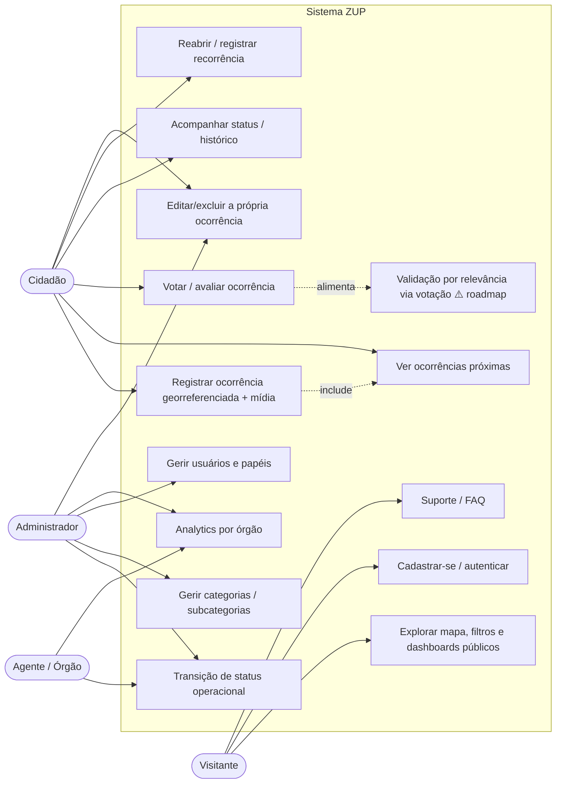
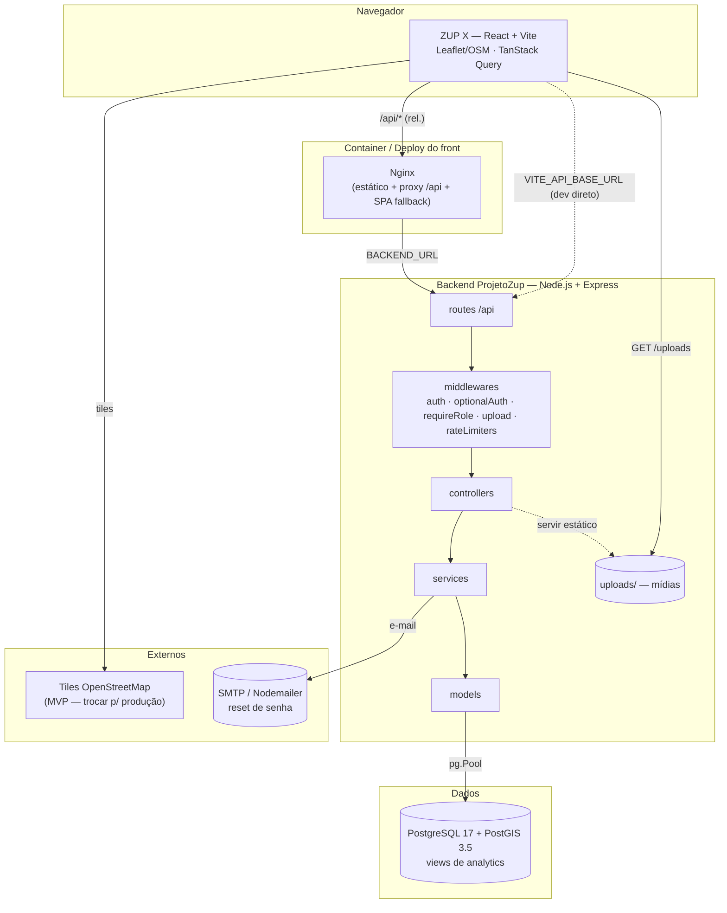
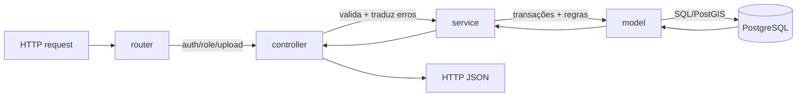

# 9. Diagramas (consolidados)

Todos em Mermaid. Os diagramas de **estados** e **ER** estão detalhados nas suas seções
([Regras §RN-05](./01-regras-de-negocio.md) e [Modelo de Dados §7.1](./07-modelo-de-dados.md));
aqui ficam os de **casos de uso**, **sequência** e **arquitetura**, cobrindo backend e frontend.

## 9.1 Casos de uso (atores × funcionalidades)



> ⚠️ Notas de fidelidade ao código: **UC10** (transição de status) e **UC7** (reabertura) hoje são
> acessíveis a **qualquer autenticado** (não apenas Agente/Admin) — o gating por perfil do front é
> visual (ver [Perfis e Permissões](./04-perfis-e-permissoes.md)). **UC14** (validação por
> relevância) é roadmap: será derivada automaticamente da votação dos cidadãos (RN-16), sem um papel
> "Validador" dedicado.

## 9.2 Sequência — registrar ocorrência (fluxo ponta a ponta)

Da interação no front até a persistência no banco, com geofencing e anti-duplicidade.

```mermaid
sequenceDiagram
    actor C as Cidadão
    participant FE as Front (ZUP X)
    participant API as API (ProjetoZup)
    participant DB as PostgreSQL/PostGIS

    C->>FE: Marca ponto no mapa
    FE->>API: GET /neighborhoods/locate?lat&lng
    API->>DB: ST_Contains(boundary, ponto)
    DB-->>API: bairro ou null
    API-->>FE: bairro detectado
    FE->>API: GET /occurrences/nearby (raio 500m)
    API-->>FE: ocorrências próximas (aviso de duplicidade)
    C->>FE: Preenche dados + fotos e publica
    FE->>API: POST /occurrences (Bearer token)
    alt duplicada (mesma categoria, ≤500m, não finalizada)
        API-->>FE: 409 { duplicate_id, distance_m }
        FE-->>C: "Ocorrência semelhante já existe"
    else criada
        API->>DB: BEGIN; INSERT occurrence (pending); INSERT status_history (null→pending); COMMIT
        API-->>FE: 201 ocorrência (status pending)
        FE->>API: POST /occurrences/:id/media (multipart, campo media)
    end
```

## 9.3 Sequência — backend interno (criação)

Foco nas camadas do servidor (router → controller → service → model).

```mermaid
sequenceDiagram
    actor C as Cidadão
    participant R as Router (auth)
    participant Ctrl as occurrencesController
    participant Svc as occurrencesService
    participant M as occurrences/neighborhoodsModel
    participant DB as PostgreSQL+PostGIS

    C->>R: POST /api/occurrences (Bearer token)
    R->>R: auth → req.user
    R->>Ctrl: create(req)
    Ctrl->>Ctrl: valida título, descrição, lat/lng, category_id
    Ctrl->>Svc: createOccurrence(data)
    Svc->>M: categoria/subcategoria existem?
    M->>DB: SELECT
    alt sem neighborhood_id
        Svc->>M: findByPoint(lng,lat)
        M->>DB: ST_Contains(boundary, ponto)
        DB-->>Svc: bairro ou null
    end
    Svc->>M: findNearby(lat,lng,500m)
    M->>DB: ST_DWithin(::geography)
    DB-->>Svc: ocorrências próximas
    alt duplicata (mesma categoria, não finalizada)
        Svc-->>Ctrl: err OCCURRENCE_DUPLICATE
        Ctrl-->>C: 409 { error, details:{duplicate_id, distance_m} }
    else ok
        Svc->>DB: BEGIN; INSERT occurrence (pending); INSERT status_history (null→pending); COMMIT
        Svc-->>Ctrl: ocorrência
        Ctrl-->>C: 201 { ...ocorrência }
    end
```

## 9.4 Sequência — ciclo de vida (validação, status e reabertura)

```mermaid
sequenceDiagram
    actor Com as Comunidade
    actor Org as Órgão/Gestão
    participant FE as Front
    participant API as API
    participant DB as PostgreSQL

    Com->>FE: Upvote/downvote
    FE->>API: POST /occurrences/:id/upvote
    API->>DB: recalcula upvote/downvote/score (transacional)
    Note over API,DB: Promoção automática por relevância (RN-16) é roadmap

    Org->>FE: Alterar status (Avançar para)
    FE->>API: PATCH /occurrences/:id/status {status}
    API->>API: valida transição (STATUS_TRANSITIONS)
    alt transição inválida
        API-->>FE: 409 {from,to,allowed}
        FE-->>Org: "Transição não permitida"
    else válida
        API->>DB: BEGIN; UPDATE status; carimba resolved_at/closed_at; INSERT histórico; COMMIT
        API-->>FE: 200 ocorrência + histórico
    end

    Note over Org,DB: problema reincide após resolved/closed
    Org->>API: POST /occurrences/:id/reopen {reason}
    API->>DB: SELECT ... FOR UPDATE (trava a original)
    alt não finalizada ou já reaberta
        API-->>Org: 409 (NOT_REOPENABLE / ALREADY_REOPENED)
    else ok
        API->>DB: BEGIN; INSERT nova ocorrência pending encadeada; reopen_count++; INSERT occurrence_reopens; INSERT histórico; COMMIT
        API-->>Org: 201 nova ocorrência
    end
```

## 9.5 Arquitetura geral (full-stack)



> No **desenvolvimento**, o front fala direto com a API por `VITE_API_BASE_URL`. No **container**, o
> bundle chama `/api` (relativo) e o **Nginx** faz proxy para `BACKEND_URL` (sem CORS, com fallback
> de SPA). Ver [10-como-rodar.md](./10-como-rodar.md).

### Arquitetura em camadas do backend (request flow)



## 9.6 Diagramas referenciados em outras seções

- **Máquina de estados da ocorrência** → [Regras de Negócio §RN-05](./01-regras-de-negocio.md).
- **Diagrama ER do banco** → [Modelo de Dados §7.1](./07-modelo-de-dados.md).
- **Navegação do frontend** → [Frontend §6.4](./06-frontend.md).
- **Fluxo de autorização no cliente** → [Perfis e Permissões §4.5](./04-perfis-e-permissoes.md).
